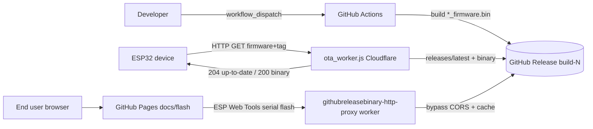

# ESP32 Lightweight GitHub Releases CI/CD + OTA

A complete, **free** deployment lifecycle for open-source ESP32 / PlatformIO hardware projects, built entirely on the GitHub ecosystem (Actions + Releases + Pages) and the free tier of Cloudflare Workers.

This repo is meant to be **copied into your own project**. Once wired up you get:

- One-click firmware builds in GitHub Actions, published as versioned GitHub Releases.
- Over-the-air (OTA) updates on the device through a tiny Cloudflare Worker that decides whether a device is already up to date and, if not, streams the new binary.
- A browser-based "web installer" hosted for free on GitHub Pages so end users can flash a device over USB with no toolchain installed.

It is based off the work in [OASMan](https://github.com/gopro2027/ArduinoAirSuspensionController).

## Why HTTP (lightweight) instead of HTTPS

The on-device OTA path deliberately talks plain **HTTP** to the OTA worker. TLS on the ESP32 requires large RX/TX buffers plus certificate storage, and that memory pressure competes directly with the `Update` flash routine, which is the most memory-sensitive moment in the whole flow. Using HTTP keeps RAM usage minimal and OTA reliable on constrained boards.

You can see this in [`Example-Github-CICD/src/directdownload.h`](Example-Github-CICD/src/directdownload.h):

```c
#define WORKER_URL "http://<worker_name>.<username>.workers.dev/?firmware="
```

and the heap logging around `Update.begin` in [`Example-Github-CICD/src/directdownload.cpp`](Example-Github-CICD/src/directdownload.cpp) that exists specifically to keep an eye on that pressure.

**If security matters more than RAM**, change `WORKER_URL` from `http://` to `https://`. Cloudflare serves the same worker over HTTPS automatically, so only the device-side URL needs to change (your board must have enough free heap for the TLS buffers during the update). Note the firmware bytes are always fetched from GitHub over HTTPS server-side inside the worker regardless of the device-side scheme.

## How it fits together



## Repository layout

- [`.github/workflows/main.yml`](.github/workflows/main.yml) - GitHub Actions build + release pipeline.
- [`Example-Github-CICD/`](Example-Github-CICD) - example PlatformIO project you can adapt:
  - [`platformio.ini`](Example-Github-CICD/platformio.ini) - dev/release environments and per-board firmware names.
  - [`src/main.cpp`](Example-Github-CICD/src/main.cpp) - minimal entry point that kicks off an OTA check.
  - [`src/directdownload.cpp`](Example-Github-CICD/src/directdownload.cpp) / [`src/directdownload.h`](Example-Github-CICD/src/directdownload.h) - the OTA client.
- [`ota_worker.js`](ota_worker.js) - Cloudflare Worker that powers device OTA.
- [`githubreleasebinary-http-proxy_worker.js`](githubreleasebinary-http-proxy_worker.js) - Cloudflare Worker reverse proxy used by the web installer to get around GitHub's CORS policy.
- [`docs/`](docs) - GitHub Pages site root:
  - [`index.html`](docs/index.html) - redirects the site root to `/flash`.
  - [`CNAME`](docs/CNAME) - optional custom domain for Pages (this repo uses `ESP32-Lightweight-Github-Releases-CICD-OTA.oasman.co`).
- [`docs/flash/`](docs/flash) - the GitHub Pages web installer:
  - [`index.html`](docs/flash/index.html) - ESP Web Tools UI.
  - [`manifestgen.js`](docs/flash/manifestgen.js) - builds the ESP Web Tools manifest at runtime.
  - `boot_app0.bin` - the boot selector binary referenced by the manifest.
- [`ota_flowchart.md`](ota_flowchart.md) - detailed diagrams of the OTA request/response flow.

## Placeholders you must replace

The GitHub references in this repo are already wired to the live example project, `gopro2027/ESP32-Lightweight-Github-Releases-CICD-OTA`. If you are copying this into your own project, search-and-replace `gopro2027` (your GitHub username/org) and `ESP32-Lightweight-Github-Releases-CICD-OTA` (your repo name) across [`ota_worker.js`](ota_worker.js), [`githubreleasebinary-http-proxy_worker.js`](githubreleasebinary-http-proxy_worker.js), [`docs/flash/index.html`](docs/flash/index.html), and [`docs/flash/manifestgen.js`](docs/flash/manifestgen.js).

The Cloudflare placeholders are still templated and must be set before deploying:

- `<worker_name>` - the name you give the OTA Cloudflare Worker. Appears in [`ota_worker.js`](ota_worker.js) and [`directdownload.h`](Example-Github-CICD/src/directdownload.h).
- `<username>` / `username` - your Cloudflare `*.workers.dev` subdomain. Appears in [`directdownload.h`](Example-Github-CICD/src/directdownload.h), [`docs/flash/index.html`](docs/flash/index.html).

---

## 1. Build and release via GitHub Actions

The pipeline is defined in [`.github/workflows/main.yml`](.github/workflows/main.yml).

### What it does

- Triggers manually via `workflow_dispatch` and takes one required input, `version_num`, which is the human-readable version shown on the device/installer.
- Installs PlatformIO, then builds each board's `*_release` environment via the generated `build_firmware.sh` helper, which runs `pio run -e <board>_release` and copies the output to `bins/<board>_<file>.bin`.
- Publishes a GitHub Release with `softprops/action-gh-release@v3`, attaching every `bins/*.bin` asset.

The release tag is `build-${{ github.run_number }}`:

```yaml
tag_name: build-${{ github.run_number }} # do not ever change this. It is used in the update process to decide if the current build is already installed
```

Do not change that tag scheme. The device stores the tag it was built with and the OTA worker compares the device's tag against the latest release's `tag_name` to decide if an update is needed.

### How to run it

1. Go to the repo's **Actions** tab.
2. Select the **esp32-build-and-release** workflow.
3. Click **Run workflow**, enter a **Version Number To Display On Screen** (the `version_num`), and confirm.
4. When it finishes, a new Release named `Release <version_num> (Build <run_number>)` appears with the firmware binaries attached.

### Release permissions (required for publishing)

The firmware build can succeed while **Create Release** fails with:

`403 Resource not accessible by integration`

[`main.yml`](.github/workflows/main.yml) already requests `contents: write`, but **the repository must allow workflows to use write access**. If the repo is set to read-only tokens, GitHub ignores the YAML and the release step keeps failing.

**Do this on the repo you run the workflow on** (your fork, if you forked this project — not only the upstream repo):

1. **Settings → Actions → General**
2. Under **Workflow permissions**, select **Read and write permissions**
3. Click **Save**


Also under **Actions permissions**, allow `softprops/action-gh-release@v3` (or **Allow all actions and reusable workflows**).

**Organization repos:** an org admin may need to enable **Allow GitHub Actions to create and approve pull requests** / permissive workflow tokens under the org’s **Actions** settings, or the repo setting above will stay read-only.

**Optional PAT fallback** (only if the setting above is locked by policy): create a classic PAT with `repo` scope (or fine-grained **Contents: Read and write** on this repository), add it as a repository secret named `RELEASE_PAT`, and re-run the workflow. The release step uses `RELEASE_PAT` when set, otherwise `github.token`.


### PlatformIO environment design

[`platformio.ini`](Example-Github-CICD/platformio.ini) splits each board into a `_dev` and a `_release` environment:

- A shared `[env]` holds the platform/board/framework and partition settings.
- Each `[env:<board>_dev]` adds `FIRMWARE_RELEASE_NAME`, which is the name the OTA worker and installer use to find that board's asset (e.g. `esp32` -> `esp32_firmware.bin`).
- `[env:release]` injects `RELEASE_VERSION` and `RELEASE_TAG_NAME` from the `version_num` / `release_tag_name` environment variables that the Actions job exports.
- Each `[env:<board>_release]` simply combines its `_dev` flags with the release flags.

To add a new board:

1. Add `[env:<board>_dev]` with its own `FIRMWARE_RELEASE_NAME`.
2. Add `[env:<board>_release]` extending it (mirroring `esp32_v2_release`).
3. Add a matching build step in [`main.yml`](.github/workflows/main.yml) (e.g. `./build_firmware.sh "Example-Github-CICD" "<board>"`).

You are not even limited to a single PlatformIO project. Because `build_firmware.sh` takes the project folder as its first argument, you can build an entirely separate project from the same workflow by pointing it at that folder, e.g. `./build_firmware.sh "My-Other-Project" "<board>"`. Add as many build steps (across as many project folders) as you like - every resulting `*_firmware.bin` is attached to the same GitHub Release.

---

## 2. OTA worker (`ota_worker.js`) on Cloudflare

[`ota_worker.js`](ota_worker.js) is a single Cloudflare Worker that the device calls to perform OTA. The full request/response flow is diagrammed in [`ota_flowchart.md`](ota_flowchart.md).

### Why one endpoint matters: release discovery is offloaded to the worker

The most important design choice here is that **the worker finds the latest release for the device**. The ESP32 makes exactly one request - it sends its firmware name and the tag it is currently running - and gets back either "you're up to date" (204) or the new binary itself (200). It never has to know which release is latest, what tag to ask for, or where the asset lives.

Previously this logic lived on the microcontroller: the device had to make a preliminary call to the GitHub API, pull down the full JSON list of releases, parse it, locate the latest release, find the matching `*_firmware.bin` asset, resolve its download URL, and only then start the actual download. On a constrained device that JSON parsing was a significant, memory-hungry, and fragile piece of code (large API responses, redirects, TLS, and partial reads frequently broke it).

All of that now happens inside the worker (`fetchCachedReleaseJson()` + `findFirmwareAsset()` in [`ota_worker.js`](ota_worker.js)):

- The worker calls the GitHub `releases/latest` API and parses the JSON server-side, where memory and a real JS runtime are not a concern.
- It compares the device's `tag` against the latest `tag_name` to decide whether an update is even needed (returning a cheap 204 if not).
- It locates the correct `<firmware>_firmware.bin` asset and resolves its download URL.
- It streams that single binary back to the device with a fixed `Content-Length`.

The result is that the device-side code in [`directdownload.cpp`](Example-Github-CICD/src/directdownload.cpp) collapses to a single `GET` and a stream into `Update.writeStream` - no JSON, no release enumeration, no second request - which is far more reliable and uses dramatically less RAM. Because the worker also caches the release JSON (see below), this consolidation does not add GitHub API load even when many devices check in at once.

### Endpoint

```
GET http://<worker_name>.<username>.workers.dev/?firmware=<FIRMWARE_RELEASE_NAME>&tag=<RELEASE_TAG_NAME>
```

- Returns **204 No Content** when the latest release's `tag_name` equals the device's `tag` (already up to date).
- Returns **200** with `Content-Type: application/octet-stream` and the firmware bytes when a newer release exists.
- Returns 400 on missing/invalid params and 404 when the requested `*_firmware.bin` asset is not in the release.

### Caching and rate-limit behavior

GitHub rate-limits both its API and raw downloads, so the worker caches aggressively (`CACHE_TTL_MS = 30 min`):

- The `releases/latest` JSON is cached for 30 minutes.
- Each firmware binary is cached for 30 minutes, keyed by the GitHub download URL.
- On a GitHub `403`/`429`, the worker serves the last good cached copy instead of failing.
- When the latest release tag changes, `invalidateFirmwareBinaries()` deletes the now-stale cached binaries so devices don't download the old build.

One important detail: the worker buffers the binary and sets an explicit `Content-Length` (no chunked `Transfer-Encoding`). The ESP32 `HTTPClient` + `Update.writeStream` path needs a fixed length, so the binary cache is versioned with `BINARY_CACHE_VERSION` (`v2-buffered`) to invalidate an earlier streamed format that broke devices. Bump that constant if you ever change the response format again.

### Deploy steps (Cloudflare dashboard)

1. Sign in at [dash.cloudflare.com](https://dash.cloudflare.com) and open **Workers & Pages**.
2. Click **Create application > Create Worker**, give it a name (this becomes `<worker_name>`), and **Deploy** the starter.
3. Click **Edit code**, delete the starter, and paste the contents of [`ota_worker.js`](ota_worker.js).
4. The two constants at the top point at the repo (already set to the example repo - change them to your own `username/repo` if you copied this project):
   - `RELEASES_LATEST_URL = 'https://api.github.com/repos/gopro2027/ESP32-Lightweight-Github-Releases-CICD-OTA/releases/latest'`
   - `BINARY_URL_PREFIX = 'https://github.com/gopro2027/ESP32-Lightweight-Github-Releases-CICD-OTA/releases/download/'`
5. **Save and deploy**. Your endpoint is now `http://<worker_name>.<username>.workers.dev/`.
6. Put that base URL into `WORKER_URL` in [`directdownload.h`](Example-Github-CICD/src/directdownload.h).

Prefer the CLI? You can instead deploy with [`wrangler`](https://developers.cloudflare.com/workers/wrangler/) (`wrangler deploy`).

---

## 3. ESP32 firmware integration

Copy [`directdownload.cpp`](Example-Github-CICD/src/directdownload.cpp) and [`directdownload.h`](Example-Github-CICD/src/directdownload.h) into your project and call `downloadUpdate(ssid, password)` when you want to check for an update. See [`main.cpp`](Example-Github-CICD/src/main.cpp):

```cpp
void setup() {
  Serial.begin(115200);
  downloadUpdate(getwifiSSID(), getwifiPassword());
}
```

Key points:

- **`RELEASE_TAG_NAME`** defaults to `build-dev` for local dev builds and is set to `build-<run_number>` by the Actions release build. The device sends this as the `tag` query param so the worker can compare it against the latest release.
- **Already up to date**: a `204` response sets `UPDATE_STATUS_FAIL_ALREADY_UP_TO_DATE` and restarts.
- **Update available**: a `200` response is streamed straight into `Update.writeStream`, then the device restarts onto the new firmware.
- **Resilience**: Wi-Fi connect and firmware install both have bounded retry loops, after which the device records a failure status and restarts.
- **RAM/stability tricks**: `btStop()` frees Bluetooth memory before the update, and `WiFi.setSleep(false)` avoids modem-sleep-induced connection drops during the transfer.
- **`setupdateResult(byte value)`** is intentionally a stub. Implement it with your preferred persistence (NVS/SPIFFS/etc.) if you want to read the OTA result after the reboot.

---

## 4. GitHub Pages web installer + reverse-proxy worker

The [`docs/flash/`](docs/flash) folder is a self-contained web installer that lets end users flash a board from the browser over USB serial using [ESP Web Tools](https://esphome.github.io/esp-web-tools/) - no PlatformIO or drivers-toolchain required.

**[View the demo of the flashing site](https://ESP32-Lightweight-Github-Releases-CICD-OTA.oasman.co/flash/)** to see what the web installer looks like (custom domain via [`docs/CNAME`](docs/CNAME)). Visiting the site root at [https://ESP32-Lightweight-Github-Releases-CICD-OTA.oasman.co/](https://ESP32-Lightweight-Github-Releases-CICD-OTA.oasman.co/) redirects to `/flash` via [`docs/index.html`](docs/index.html).

**Note:** this is a demo only — flashing will not succeed because the Cloudflare workers are not published.

- [`index.html`](docs/flash/index.html) fetches your repo's releases from the GitHub API, lists boards, and wires up the install button.
- [`manifestgen.js`](docs/flash/manifestgen.js) builds the ESP Web Tools manifest at runtime, pointing at the bootloader, partitions, `boot_app0.bin`, and firmware with the correct flash offsets (`0x1000`, `0x8000`, `0xe000`, `0x10000`). It also duplicates the build entry for the ESP32-S3 chip family with a `0` bootloader offset, and `boot_app0.bin` is loaded from `raw.githubusercontent.com`.

### Why the reverse-proxy worker is required

GitHub release download links do **not** send permissive CORS headers, so a browser cannot fetch `*.bin` assets directly - the request is blocked. To work around this, `getReleaseAsset()` in [`index.html`](docs/flash/index.html) routes binary downloads through [`githubreleasebinary-http-proxy_worker.js`](githubreleasebinary-http-proxy_worker.js):

```
https://githubreleasebinary-http-proxy.<username>.workers.dev/?url=https://github.com/.../releases/download/<tag>/<asset>
```

The proxy fetches the asset server-side and re-serves it with `Access-Control-Allow-Origin: *`. Like the OTA worker, it **caches each binary for 30 minutes** and serves the cached copy on GitHub `403`/`429` rate limits, so repeated installs stay fast and don't burn through rate limits.

### Deploy steps

1. Create a **second** Cloudflare Worker (same flow as section 2) and paste [`githubreleasebinary-http-proxy_worker.js`](githubreleasebinary-http-proxy_worker.js).
2. The allowed prefix check is preset to the example repo - if you copied this project, edit it to match yours:
   `targetUrl.startsWith('https://github.com/gopro2027/ESP32-Lightweight-Github-Releases-CICD-OTA/releases/download/')`.
3. Deploy, noting its `*.workers.dev` URL.
4. In [`docs/flash/index.html`](docs/flash/index.html) and [`docs/flash/manifestgen.js`](docs/flash/manifestgen.js), the repo references are preset to `gopro2027/ESP32-Lightweight-Github-Releases-CICD-OTA`; swap in your own user/repo and the proxy worker URL, and adjust the board radio options to match your boards.
5. Enable GitHub Pages (see the next section), then your installer is live at `https://gopro2027.github.io/ESP32-Lightweight-Github-Releases-CICD-OTA/flash/` (using your own user/repo if you copied the project).

### Setting up the GitHub Pages site

The web installer is hosted for free out of the [`docs/`](docs) folder on GitHub Pages. To enable it:

1. Push this repo (including the [`docs/flash/`](docs/flash) folder) to GitHub.
2. In your repo, go to **Settings > Pages**.
3. Under **Build and deployment > Source**, choose **Deploy from a branch**.
4. Set the branch to **`main`** and the folder to **`/docs`**, then click **Save**.
5. Wait for the first deployment to finish (GitHub shows the live URL at the top of the Pages settings once it is ready; it can take a minute or two on the first publish).
6. The installer is served at `https://<your-username>.github.io/<your-repo>/flash/` - for the example repo that is [`https://gopro2027.github.io/ESP32-Lightweight-Github-Releases-CICD-OTA/flash/`](https://gopro2027.github.io/ESP32-Lightweight-Github-Releases-CICD-OTA/flash/). You can also [view the demo of the flashing site](https://ESP32-Lightweight-Github-Releases-CICD-OTA.oasman.co/flash/) on the custom domain to preview the UI (**note:** flashing will not succeed there because the workers are not published).

Notes:

- [`docs/index.html`](docs/index.html) at the Pages root redirects `/` to `/flash`, so users can share the shorter site URL and still land on the installer.
- GitHub Pages only serves over **HTTPS**, which is required anyway because [ESP Web Tools](https://esphome.github.io/esp-web-tools/) needs a secure context to access the Web Serial API.
- The page must reach your deployed reverse-proxy worker, so deploy that worker (steps 1-3 above) and update the URL in [`docs/flash/index.html`](docs/flash/index.html) before relying on the live site.
- The site is fully static, so re-publishing is just a `git push` to `main`; the cached firmware list comes from the GitHub Releases API at page load, so new releases appear automatically (subject to the worker's ~30 minute cache).
- A custom domain can be configured under **Settings > Pages > Custom domain** if you do not want the `github.io` URL (this repo uses [`docs/CNAME`](docs/CNAME) for `ESP32-Lightweight-Github-Releases-CICD-OTA.oasman.co`).

---

## 5. Other important notes

- **Completely free**: GitHub Actions, Releases, and Pages plus the Cloudflare Workers free tier cover the entire lifecycle at no cost for typical open-source hardware projects.
- **Propagation delay**: because the OTA worker and proxy cache for 30 minutes, a brand-new release can take up to ~30 minutes to reach devices/installer. To force a refresh sooner, redeploy the worker (which clears its cache) or wait out the TTL.
- **Security trade-offs**: device OTA uses HTTP by default for RAM reasons (see the top of this README). Switch the device-side `WORKER_URL` to `https://` if you need transport encryption and have the heap headroom. Note that GitHub Releases are public, so anyone can download your firmware binaries.
- **Adapting to your project (checklist)**:
  1. Replace every placeholder token listed above.
  2. Set **Settings → Actions → General → Workflow permissions** to **Read and write** on your repo (see [Release permissions](#release-permissions-required-for-publishing)).
  3. Deploy both Cloudflare Workers (OTA + reverse proxy).
  4. Set `WORKER_URL` in `directdownload.h` to your OTA worker.
  5. Define your boards in `platformio.ini` and add matching Actions build steps.
  6. Enable GitHub Pages on `/docs` if you want the web installer.
